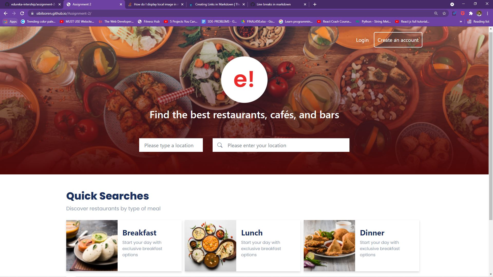

# Assignment-2

In this assignment we used Bootstrap along side HTML and CSS for making responsive web sites, We learnt how to use different classes to make the desired layout and design for our assignment.

Live link below:-  

[Assignment 2](https://sibilsoren.github.io/Assignment-2/)

